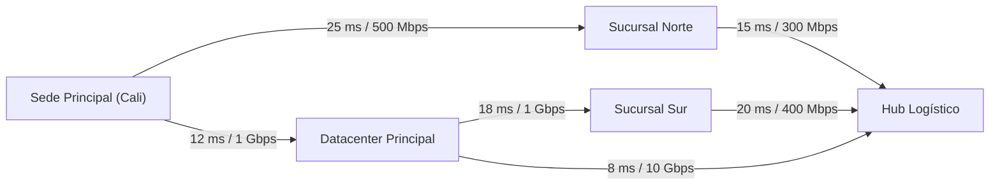

# 🌐 UAO - Red Empresarial mediante Grafos y Optimización de Rutas

[](https://www.uao.edu.co/)
[](https://github.com/EduardCY/UAO-EDA2-Red-Empresarial-Grafos)
[](https://react.dev/)
[](LICENSE)
[](.github/workflows/ci.yml)
[](https://github.com/EduardCY)

> **Plataforma interactiva de análisis de redes de telecomunicación y logística empresarial**, con cálculo de ruta más corta (**Algoritmo de Dijkstra**), árbol de recubrimiento mínimo (**Prim / Kruskal**) y visualización topológica en tiempo real.

---

## 🎯 Arquitectura de la Solución

El sistema modela una infraestructura de sedes empresariales representadas como un grafo ponderado $G = (V, E)$, donde:
* $V$ representa las sedes físicas, datacenters y sucursales.
* $E$ representa las troncales de red con latencia, ancho de banda y costos asociados.

---

## 🏛️ Topología de Red y Enrutamiento Óptimo



---

## ⚡ Algoritmos de Grafos Implementados

| Algoritmo | Propósito Operativo | Complejidad Temporal | Complejidad Espacial |
|---|---|---|---|
| **Dijkstra** | Ruta con mínima latencia entre sedes | $O((V + E) \log V)$ | $O(V)$ |
| **Prim** | Diseño de red troncal de costo mínimo (MST) | $O(E \log V)$ | $O(V)$ |
| **Kruskal** | Unión de componentes disjuntas mediante DSU | $O(E \log E)$ | $O(V)$ |
| **Matriz de Adyacencia** | Consulta instantánea de adyacencia | $O(1)$ | $O(V^2)$ |
| **Lista de Adyacencia** | Representación eficiente de grafos dispersos | $O(grado(u))$ | $O(V + E)$ |

---

## 🚀 Instalación Rápida

```bash
git clone https://github.com/EduardCY/UAO-EDA2-Red-Empresarial-Grafos.git
cd UAO-EDA2-Red-Empresarial-Grafos

npm install
npm run dev
```

---

## 👨‍💻 Autor

* **Autor:** Eduard Criollo Yule ([@EduardCY](https://github.com/EduardCY))
* **Licencia:** [MIT](LICENSE).
